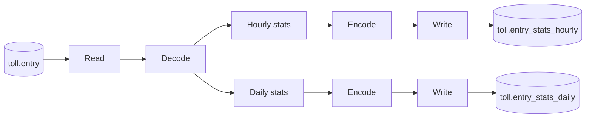
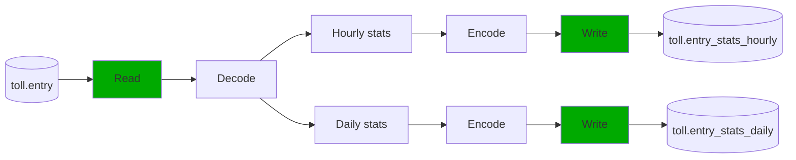
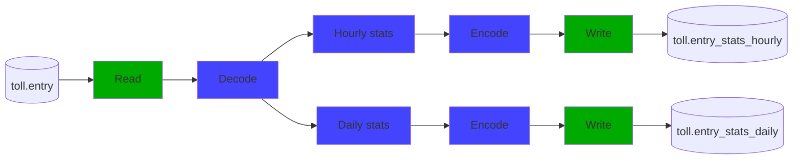

# Test Driven Development for Data Engineers

<div class="uppercase text-sm tracking-widest">
Marcin Kuthan
</div>

<div class="abs-br mx-5 my-5 flex">
  
</div>

<!--
Warm welcome
-->

---
layout: intro
---

## About Me

* Data Engineer / Technical Leader @ Allegro (9 years)
* JEE Software Engineer @ Roche (7 years)
* Software engineer wannabe @ PIT (7 years)

<!--
* PIT - Military systems, I've learned programming and importance of CI automation
* Roche - Enterprise systems for pharma, I've learned software engineering, clean code, testing and architecture
* Allegro - Large e-commerce, I've learned distributed 24/7 systems, on-prem cloud and public cloud (GCP)
-->

---
layout: intro
---

## About My Team

* Build real-time, highly scalable and fault-tolerant clickstream ingestion platform
* Process a few billion events every day with e2e latency below one minute
* Run services on-prem
* Run stream and batch data pipelines on GCP

<!--
* Clickstream - Allegro clients interactions with mobile and web platforms
* Traffic: 100k+ events/sec, it gives ~ 4-5 billion of events daily
* Stream latency: events available on Kafka (on-prem) and on Pubsub (GCP) in a few seconds
* Batch latency: events available in BigQuery in minute
*   Today focus: Apache Beam data pipelines on Dataflow, managed service on GCP for unified stream and batch
-->

---
layout: intro
---

## About Allegro Data & AI

* 300k+ events / sec (front-end + backend)
* Petabyte+ data warehouse
* 1000+ BigQuery tables
* 200+ engineers in Data & AI department (of 1000+ total)
* Scala, Python, SQL, Kotlin, Java ...
  
<!--
* BigData for real
* Many smart software, data and platform engineers
* Real challenges due to ogranization size and diversity
-->

---
layout: statement
---

## What if you reduce development cycle time <br/>from 30 minutes to 10 seconds<br/>and deliver code of higher quality?

<!--
* Typical data engineer workflow: develop, assembly, deploy, wait for starting, wait for processing, verify the results using SQL
* It takes more than 10 seconds.
-->

---

## TL;DR

* Technology stack 3 minutes intro
* Sample batch data pipeline
* Red 🔴 ---> Green 🟢 ---> Refactor ---> …
* Summary

---
layout: two-cols
---

## Apache Beam

* Unified batch and streaming
* Write once, run everywhere
* Java, Python, Go, SQL

::right::

<v-click>

## Spotify Scio

* Scala SDK
* Macro generated coders
* Type-safe BigQuery API

</v-click>

<!-- 
1) non-trivial business logic can be re-used in batch and streaming
   * batch tested on Spark runner, streaming tested on Flink runner
   * Dataflow - expensive but gooood, Direct - for local testing
2) Java - mature, Python - more focused on ML, Go - catching up, SQL - so/so

3) fluent, functional like API
4) no boilerplate
5) type-safety
-->

---
layout: image
image: /cars-in-toll-booth.jpg
---

## Toll Booth Entry Statistics

* How many vehicles crossed the toll booth entry
* How many tolls the toll booth collected
* Time of the first and the last entry

---

## Data pipeline



---
layout: section
---

## Let's code

---

## Data pipeline "job/e2e" test

```scala {2,6-7,14-15|8-13|all}
import org.scalatest.*
import com.spotify.scio.*
import org.mkuthan.streamprocessing.*

class TollBoothEntryStatsJobTest extends AnyFlatSpec with Matchers with JobTestScioContext {
  "Toll job" should "run in the batch mode" in {
    JobTest[TollBoothEntryStatsJob.type]
      .args(
        "--effectiveDate=2014-09-10",
        "--entryTable=toll.entry",
        "--entryStatsHourlyTable=toll.entry_stats_hourly",
        "--entryStatsDailyTable=toll.entry_stats_daily"
      )
      .run()
  }
}
```

---

## Run the test 🔴

```scala {all|2,6}
sbt> testOnly *TollBoothEntryStatsJobTest
[error] TollBoothEntryStatsJobTest.scala:12:13: not found: value TollBoothEntryStatsJob
[error]     JobTest[TollBoothEntryStatsJob.type]
[error]             ^
[error] one error found
[error] (Test / compileIncremental) Compilation failed
```

---

## Parse command line arguments

```scala {4-5,14-15|1,6,13|8-11,2|all}
import com.spotify.scio.*
import org.joda.time.*

object TollBoothEntryStatsJob {
  def main(mainArgs: Array[String]): Unit = {
    val (sc, args) = ContextAndArgs(mainArgs)

    val effectiveDate = LocalDate.parse(args.required("effectiveDate"))
    val entryTable = args.required("entryTable")
    val entryStatsHourlyTable = args.required("entryStatsHourlyTable")
    val entryStatsDailyTable = args.required("entryStatsDailyTable")

    sc.run()
  }
}
```

---

## Run the test 🟢

```scala {all|5,8}
sbt> testOnly *TollBoothEntryStatsJobTest
[info] TollBoothEntryStatsJobTest:
[info] Toll job
[info] - should run in the batch mode
[info] Run completed in 3 seconds, 877 milliseconds.
[info] Total number of tests run: 1
[info] Suites: completed 1, aborted 0
[info] Tests: succeeded 1, failed 0, canceled 0, ignored 0, pending 0
[info] All tests passed.
```

---

## toll.entry data model

```scala {all|4}
import com.spotify.scio.bigquery.types.BigQueryType

object TollBoothEntry {
  @BigQueryType.toTable
  final case class Record(
    id: String,
    entry_time: Instant,
    license_plate: String,
    toll: BigDecimal,
  )
}
```

---

## toll.entry test fixture

```scala
trait TollBoothEntryFixture {
  final val anyTollBoothEntryRecord = TollBoothEntry.Record(
    id = "1",
    entry_time = Instant.parse("2014-09-10T12:01:00Z"),
    license_plate = "JNB 7001",
    toll = BigDecimal(7),
  )
}
```

---

## Job test with stub for toll.entry

```scala{9-12}
"Toll job" should "run in the batch mode" in {
  JobTest[TollBoothEntryStatsJob.type]
    .args(
    "--effectiveDate=2014-09-10",
    "--entryTable=toll.entry",
    "--entryStatsHourlyTable=toll.entry_stats_hourly",
    "--entryStatsDailyTable=toll.entry_stats_daily"
    )
    .input(
      CustomIO[TollBoothEntry.Record]("entry-table-id"),
      Seq(anyTollBoothEntryRecord)
    )
    .run()
}
```

---

## Run the test 🔴

```scala{5-6}
sbt> testOnly *TollBoothEntryStatsJobTest
[info] TollBoothEntryStatsJobTest:
[info] Toll job
[info] - should run in the batch mode *** FAILED ***
[info]   java.lang.IllegalArgumentException: requirement failed:
Unmatched test input: CustomIO(entry-table-id)
[info] Run completed in 3 seconds, 891 milliseconds.
[info] Total number of tests run: 1
[info] Suites: completed 1, aborted 0
[info] Tests: succeeded 0, failed 1, canceled 0, ignored 0, pending 0
[info] *** 1 TEST FAILED ***
```

---

## Read from BigQuery

```scala{9-15|all}
def main(mainArgs: Array[String]): Unit = {
  val (sc, args) = ContextAndArgs(mainArgs)

  val effectiveDate = LocalDate.parse(args.required("effectiveDate"))
  val entryTable = args.required("entryTable")
  val entryStatsHourlyTable = args.required("entryStatsHourlyTable")
  val entryStatsDailyTable = args.required("entryStatsDailyTable")

  val entryRecords = sc.readFromBigQuery(
    IoIdentifier[TollBoothEntry.Record]("entry-table-id"),
    BigQueryTable[TollBoothEntry.Record](entryTable),
    StorageReadConfiguration().withRowRestriction(
      RowRestriction.TimestampColumnRestriction("entry_time", effectiveDate)
    )
  )

  sc.run()
}

```

---

## Run the test 🟢

```scala{5,8}
sbt> testOnly *TollBoothEntryStatsJobTest
[info] TollBoothEntryStatsJobTest:
[info] Toll job
[info] - should run in the batch mode
[info] Run completed in 4 seconds, 497 milliseconds.
[info] Total number of tests run: 1
[info] Suites: completed 1, aborted 0
[info] Tests: succeeded 1, failed 0, canceled 0, ignored 0, pending 0
[info] All tests passed.
```

---

## toll.entry_stats data model

```scala
import com.spotify.scio.bigquery.types.BigQueryType

object TollBoothStats {
  @BigQueryType.toTable
  final case class Record(
    created_at: Instant,
    id: String,
    count: Int,
    total_toll: BigDecimal,
    first_entry_time: Instant,
    last_entry_time: Instant
 )
}
```

---

## toll.entry_stats test fixture

```scala
trait TollBoothStatsFixture {
  final val anyTollBoothStatsRecord = TollBoothStats.Record(
    created_at = Instant.EPOCH,
    id = "1",
    total_toll = BigDecimal(7),
    count = 1,
    first_entry_time = Instant.parse("2014-09-10T12:01:00.000Z"),
    last_entry_time = Instant.parse("2014-09-10T12:01:00.000Z")
  )
}
```

---

## Job test with toll.entry_stats expectations

```scala{8-13|14-19}
"Toll job" should "run in the batch mode" in {
  JobTest[TollBatchJob.type]
    .args() // omitted
    .input(
      CustomIO[TollBoothEntry.Record]("entry-table-id"),
      Seq(anyTollBoothEntryRecord)
    )
    .output(CustomIO[TollBoothStats.Record]("entry-stats-hourly-table-id")) { results =>
      val endOfHourlyWindow = Instant.parse("2014-09-10T12:59:59.999Z")
      results should containElements(
        anyTollBoothStatsRecord.copy(created_at = endOfHourlyWindow)
      )
    }
    .output(CustomIO[TollBoothStats.Record]("entry-stats-daily-table-id")) { results =>
      val endOfDailyWindow = Instant.parse("2014-09-10T23:59:59.999Z")
      results should containElements(
        anyTollBoothStatsRecord.copy(created_at = endOfDailyWindow)
      )
    }
    .run()
}
```

---

## Run the test 🔴

```scala{5-8}
sbt> testOnly *TollBoothEntryStatsJobTest
[info] TollBoothEntryStatsJobTest:
[info] Toll job
[info] - should run in the batch mode *** FAILED ***
[info]   java.lang.IllegalArgumentException: requirement failed:
Unmatched test output:
CustomIO(entry-stats-hourly-table-id),
CustomIO(entry-stats-daily-table-id)
[info] Run completed in 8 seconds, 704 milliseconds.
[info] Total number of tests run: 1
[info] Suites: completed 1, aborted 0
[info] Tests: succeeded 0, failed 1, canceled 0, ignored 0, pending 0
[info] *** 1 TEST FAILED ***
```

---

## Write to BigQuery

```scala{11-15|17-20|22|all}
def main(mainArgs: Array[String]): Unit = {
  val (sc, args) = ContextAndArgs(mainArgs)

  val effectiveDate = LocalDate.parse(args.required("effectiveDate"))
  val entryTable = args.required("entryTable")
  val entryStatsHourlyTable = args.required("entryStatsHourlyTable")
  val entryStatsDailyTable = args.required("entryStatsDailyTable")

  val entryRecords = sc.readFromBigQuery() // Omitted

  // TODO: calculate hourly stats, now it's a test fixture
  val endOfHourlyWindow = Instant.parse("2014-09-10T12:59:59.999Z")
  val hourlyStatsRecords = sc.parallelize(
    Seq(anyTollBoothStatsRecord.copy(created_at = endOfHourlyWindow)
  )

  hourlyStatsRecords.writeBoundedToBigQuery(
    IoIdentifier("entry-stats-hourly-table-id"),
    BigQueryPartition.daily(entryStatsHourlyTable, effectiveDate)
  )

  // similar code for daily stats

  sc.run()
}

```

---

## Run the test 🟢

```scala{5,8}
sbt> testOnly *TollBoothEntryStatsJobTest
[info] TollBoothEntryStatsJobTest:
[info] Toll job
[info] - should run in the batch mode
[info] Run completed in 6 seconds, 770 milliseconds.
[info] Total number of tests run: 1
[info] Suites: completed 1, aborted 0
[info] Tests: succeeded 1, failed 0, canceled 0, ignored 0, pending 0
[info] All tests passed.
```

---

## Data pipeline



---

## Domain types for toll booth entries

```scala{1-3|5-7|all}
final case class TollBoothId(id: String) {
  require(!id.isEmpty, "Toll booth id is empty")
}

final case class LicensePlate(number: String) {
  require(!number.isEmpty, "License plate number is empty")
}

final case class TollBoothEntry(
  id: TollBoothId,
  entryTime: Instant,
  licensePlate: LicensePlate,
  toll: BigDecimal
) {
    require(toll >= 0, s"Toll is negative: $toll")
}
```

---

## Domain test fixture

```scala
trait TollBoothEntryFixture {
  final val anyTollBoothEntry = TollBoothEntry(
    id = TollBoothId("1"),
    entryTime = Instant.parse("2014-09-10T12:01:00Z"),
    toll = BigDecimal(7),
    licensePlate = LicensePlate("JNB 7001")
  )
}
```

---

## Decoding record "unit" test (1)

```scala{1-8,19-20|9-11|13|15-17}
import org.scalatest.*
import org.mkuthan.streamprocessing.test.*

class TollBoothEntryTest extends AnyFlatSpec with Matchers
    with TestScioContext
    with TollBoothEntryFixture {

  "ToolBoothEntry" should "decode valid record into TollBoothEntry" in runWithScioContext { sc =>
    val inputs = boundedTestCollectionOf[TollBoothEntry.Record]
      .addElementsAtMinimumTime(anyTollBoothEntryRecord)
      .advanceWatermarkToInfinity()

    val results = decodeRecord(sc.testBounded(inputs))

    results.withTimestamp should containElementsAtTime(
      anyTollBoothEntry.entryTime,
      anyTollBoothEntry
    )
  }
}
```

---

## Decoding record "domain/integration" test (2)

```scala{1,4,7,10,14-15}
"ToolBoothEntry" should "throw an exception for invalid record" in {
    val thrown = the[RuntimeException] thrownBy {
      runWithScioContext { sc =>
        val invalidRecord = anyTollBoothEntryRecord.copy(id = "")

        val inputs = boundedTestCollectionOf[TollBoothEntry.Record]
          .addElementsAtMinimumTime(invalidRecord)
          .advanceWatermarkToInfinity()

        decodeRecord(sc.testBounded(inputs))

      }
    }
    thrown.getMessage should include("Toll booth id is empty")
  }
```

---

## Run the test 🔴

```scala{2-3,5-7,10}
sbt:tollDomain> testOnly *TollBoothEntryTest
[error] TollBoothEntryTest.scala:59:19: not found: value decodeRecord
[error]     val results = decodeRecord(sc.testBounded(inputs))
[error]                   ^
[error] TollBoothEntryTest.scala:73:9: not found: value decodeRecord
[error]         decodeRecord(sc.testBounded(inputs))
[error]         ^
[error] two errors found
[error] (Test / compileIncremental) Compilation failed
```

---

## Decode record into domain type

```scala{1-2,16|5,9-15|6}
object TollBoothEntry {
  def decodeRecord(input: SCollection[TollBoothEntry.Record]): SCollection[TollBoothEntry] =
    input.transform { in =>
      in
        .map(record => fromRecord(record))
        .timestampBy(boothEntry => boothEntry.entryTime)
    }

  private def fromRecord(record: TollBoothEntry.Record) =
    TollBoothEntry(
      id = TollBoothId(record.id),
      entryTime = record.entry_time,
      licensePlate = LicensePlate(record.license_plate),
      toll = record.toll
    )
}
```

---

## Run the test 🟢

```scala{6,9}
sbt:tollDomain> testOnly *TollBoothEntryTest
[info] TollBoothEntryTest:
[info] TollBoothEntry
[info] - should decode valid record into TollBoothEntry
[info] - should throw an exception for invalid record
[info] Run completed in 8 seconds, 362 milliseconds.
[info] Total number of tests run: 2
[info] Suites: completed 1, aborted 0
[info] Tests: succeeded 2, failed 0, canceled 0, ignored 0, pending 0
[info] All tests passed.
```

---

## Domain type for toll booth statistics

```scala{1-7,12|8-11}
final case class TollBoothStats(
  id: TollBoothId,
  count: Int,
  totalToll: BigDecimal,
  firstEntryTime: Instant,
  lastEntryTime: Instant
) {
  private def before(other: TollBoothStats): Boolean =
    firstEntryTime.isBefore(other.firstEntryTime)
  private def after(other: TollBoothStats): Boolean =
    lastEntryTime.isAfter(other.lastEntryTime)
}

```

---

## Domain test fixture

```scala
trait TollBoothStatsFixture {
  final val anyTollBoothStats = TollBoothStats(
    id = TollBoothId("1"),
    totalToll = BigDecimal(7),
    count = 1,
    firstEntryTime = Instant.parse("2014-09-10T12:01:00.000Z"),
    lastEntryTime = Instant.parse("2014-09-10T12:01:00.000Z")
  )
}
```

---

## Calculate statistics "domain/integration" test (1)

```scala{1-3|4-5|7-11|13-17|19-23}
class TollBoothStatsTest extends AnyFlatSpec with Matchers with ... {

  TollBoothStats should "calculate statistics in fixed window" in runWithScioContext { sc =>
    val tollBoothId1 = TollBoothId("1")
    val tollBoothId2 = TollBoothId("2")

    val entry1 = anyTollBoothEntry.copy(
      id = tollBoothId1,
      entryTime = Instant.parse("2014-09-10T12:01:00.000Z"),
      toll = BigDecimal(2)
    )

    val entry2 = anyTollBoothEntry.copy(
      id = tollBoothId1,
      entryTime = Instant.parse("2014-09-10T12:01:30.000Z"),
      toll = BigDecimal(1)
    )

    val entry3 = anyTollBoothEntry.copy(
      id = tollBoothId2,
      entryTime = Instant.parse("2014-09-10T12:04:00.000Z"),
      toll = BigDecimal(4)
    )

    (...)
```

---

## Calculate statistics "domain/integration" test (2)

```scala{1-5|7|9-25}
val inputs = boundedTestCollectionOf[TollBoothEntry]
  .addElementsAtTime(entry1.entryTime, entry1)
  .addElementsAtTime(entry2.entryTime, entry2)
  .addElementsAtTime(entry3.entryTime, entry3)
  .advanceWatermarkToInfinity()

val results = calculateInFixedWindow(sc.testBounded(inputs), Duration.standardMinutes(5))

results.withTimestamp should containElementsAtTime(
  "2014-09-10T12:04:59.999Z",
  anyTollBoothStats.copy(
    id = tollBoothId1,
    count = 2,
    totalToll = BigDecimal(2 + 1),
    firstEntryTime = entry1.entryTime,
    lastEntryTime = entry2.entryTime
  ),
  anyTollBoothStats.copy(
    id = tollBoothId2,
    count = 1,
    totalToll = BigDecimal(4),
    firstEntryTime = entry3.entryTime,
    lastEntryTime = entry3.entryTime
  )
)
```

---

## Run the test 🔴

```scala{2-3,6}
sbt:tollDomain> testOnly *TollBoothStatsTest
[error] TollBoothStatsTest.scala:56:19: not found: value calculateInFixedWindow
[error]     val results = calculateInFixedWindow(sc.testBounded(inputs), FiveMinutes, DefaultWindowOptions)
[error]                   ^
[error] one error found
[error] (Test / compileIncremental) Compilation failed
```

---

## Calculate statistics (1)

```scala{1,10|3-9|2|all}
implicit val TollBoothStatsSumByKey = SumByKey.create(
  keyFn = _.id.id,
  plusFn = (x, y) =>
    x.copy(
      count = x.count + y.count,
      totalToll = x.totalToll + y.totalToll,
      firstEntryTime = if (x.before(y)) x.firstEntryTime else y.firstEntryTime,
      lastEntryTime = if (x.after(y)) x.lastEntryTime else y.lastEntryTime
    )
)
```

<!--
Quiz: functional programming, who knows what a semigroup is?
-->

---

## Calculate statistics (2)

```scala{2-5|8,12-18|9|all}
object TollBoothStats {
  def calculateInFixedWindow(
    input: SCollection[TollBoothEntry],
    windowDuration: Duration
  ): SCollection[TollBoothStats] =
    input.transform { in =>
      in
        .map(fromBoothEntry)
        .sumByKeyInFixedWindow(windowDuration)
    }

  private def fromBoothEntry(boothEntry: TollBoothEntry) = TollBoothStats(
    id = boothEntry.id,
    count = 1,
    totalToll = boothEntry.toll,
    firstEntryTime = boothEntry.entryTime,
    lastEntryTime = boothEntry.entryTime
  )
}
```

---

## Run the test 🟢

```scala{5,8}
sbt> testOnly *TollBoothStatsTest
[info] TollBoothStatsTest:
[info] TollBoothStats
[info] - should calculate statistics in fixed window
[info] Run completed in 7 seconds, 553 milliseconds.
[info] Total number of tests run: 1
[info] Suites: completed 1, aborted 0
[info] Tests: succeeded 1, failed 0, canceled 0, ignored 0, pending 0
[info] All tests passed.
```

---

## Finish data pipeline

```scala{1-4|6|8-11|13-18}
def main(mainArgs: Array[String]): Unit = {
  val (sc, args) = ContextAndArgs(mainArgs)
  // parse arguments
  val entryRecords = sc.readFromBigQuery(...)

  val entries = TollBoothEntry.decodeRecord(entryRecords)

  val tollBoothStatsHourly = TollBoothStats
    .calculateInFixedWindow(entries, Duration.standardHours(1))
  val tollBoothStatsDaily = TollBoothStats
    .calculateInFixedWindow(entries, Duration.standardDays(1))

  TollBoothStats
    .encodeRecord(tollBoothStatsHourly)
    .writeBoundedToBigQuery(
      IoIdentifier[TollBoothStats.Record]("entry-stats-hourly-table-id"),
      BigQueryPartition.daily(entryStatsHourlyTable, effectiveDate)
    )
  
  // similar code for daily stats 
}
```

---

## Revisit "e2e" test

```scala
"Toll job" should "run in the batch mode" in {
  JobTest[TollBoothEntryStatsJob.type]
    .args(
      "--effectiveDate=2014-09-10",
      "--entryTable=toll.entry",
      "--entryStatsHourlyTable=toll.entry_stats_hourly",
      "--entryStatsDailyTable=toll.entry_stats_daily"
    )
    .input(
      CustomIO[TollBoothEntry.Record]("entry-table-id"),
      Seq(anyTollBoothEntryRecord)
    )
    .output(CustomIO[TollBoothStats.Record]("entry-stats-hourly-table-id")) { results =>
      val endOfHourlyWindow = Instant.parse("2014-09-10T12:59:59.999Z")
      results should containElements(anyTollBoothStatsRecord.copy(created_at = endOfHourlyWindow))
    }
    .output(CustomIO[TollBoothStats.Record]("entry-stats-daily-table-id")) { results =>
      val endOfDailyWindow = Instant.parse("2014-09-10T23:59:59.999Z")
      results should containElements(anyTollBoothStatsRecord.copy(created_at = endOfDailyWindow))
    }
    .run()
}
```

---

## Run the test 🟢

```scala{5,8}
sbt> testOnly *TollBoothEntryStatsJobTest
[info] TollBoothEntryStatsJobTest:
[info] Toll job
[info] - should run in the batch mode
[info] Run completed in 8 seconds, 704 milliseconds.
[info] Total number of tests run: 1
[info] Suites: completed 1, aborted 0
[info] Tests: succeeded 1, failed 0, canceled 0, ignored 0, pending 0
[info] All tests passed.
```

---

## Data pipeline



---
layout: statement
---

## What next?

<!--
1. More domain tests
2. Defined infrastructure as a code
3. Do first deployment
-->

---
layout: statement
---

## Key advices

Test with "framework of your choice" using **local** runner

Start with happy path end--to--end test scenario

Don't miss testing domain invariants and business logic

Failing test first

---
layout: image-right
image: /qrcode_mkuthan.github.io.png
---

## More about TDD for DE

<https://mkuthan.github.io/blog/2023/11/02/tdd-for-de/>

---
layout: image-right
image: /qrcode_jobs.allegro.eu.png
---

## We're Hiring

<https://jobs.allegro.eu/>

---
layout: center
---

## Q&A
